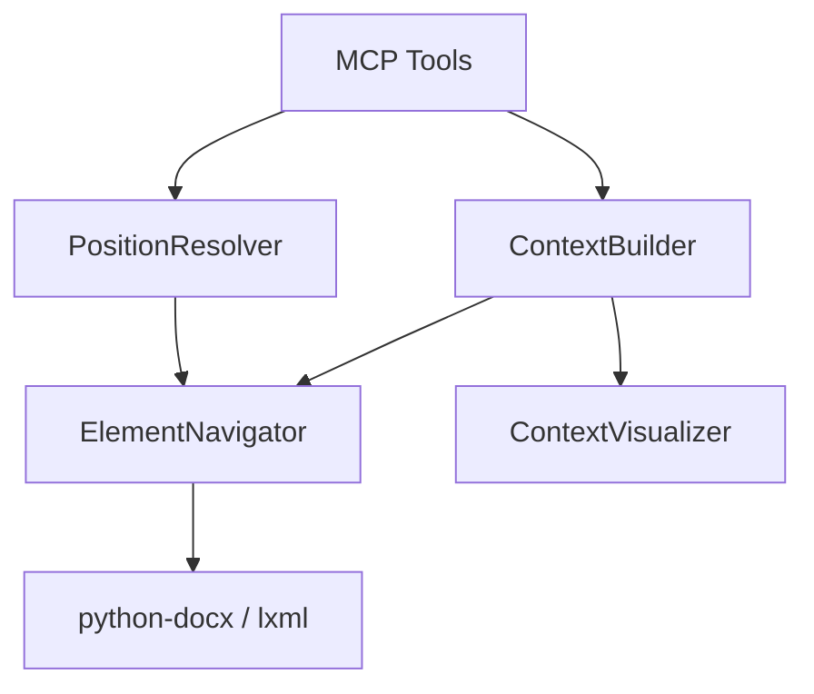

# 设计文档: Cursor Navigation Enhanced

**版本**: 2.0 (Redesign)
**状态**: Draft
**关联需求**: docs/dev/cursor-navigation-enhanced/cursor-navigation-enhanced-requirements.md

## 1. 核心架构设计

为了实现上下文增强和直观展示，我们将引入一个新的核心模块 `docx_mcp_server.services.navigation`，包含以下组件：

### 1.1 组件图



### 1.2 核心类定义

#### A. `ContextVisualizer` (新组件 - 负责直观呈现)
负责生成对 LLM 友好的 ASCII 树状视图。

```python
class ContextVisualizer:
    def generate_tree_view(self, element, depth=1, sibling_range=1) -> str:
        """
        生成如下格式的字符串:
        Body
        ├── Heading 1 (h_123): "Introduction"
        ├── [Paragraph (p_456): "Current text..."] <--- You are here
        └── Table (t_789): 3 rows, 2 cols
        """
        pass
```

#### B. `ContextBuilder` (负责组装数据)
负责收集 ID、路径和调用 Visualizer。

```python
class ContextBuilder:
    def build_cursor_context(self, element, view_mode="concise") -> dict:
        """
        返回:
        {
            "element_id": "...",
            "parent_id": "...",
            "path": "body/table_0/row_0/cell_0",
            "visual": "..." (由 Visualizer 生成)
        }
        """
        pass
```

#### C. `PositionResolver` (负责解析位置)
负责解析 `position` 参数并执行插入操作。将复用 `cursor_tools.py` 和 `copy_engine.py` 中的现有逻辑。

```python
class PositionResolver:
    def resolve_and_insert(self, new_element_factory, position_str: str, session):
        """
        position_str: "after:para_123", "before:table_456", "inside:cell_789"
        """
        pass
```

## 2. 数据结构设计

### 2.1 增强的 Cursor JSON
所有工具的返回结构将标准化为：

```json
{
  "status": "success",
  "data": {
    "element_id": "para_new_123",
    "cursor": {
      "element_id": "para_new_123",
      "parent_id": "sect_body",
      "path": "body/para_5",
      "visual": "Body\n├── (p_old)... \n├── [Para: \"New Content\"] ✨\n└── (t_next)..."
    }
  }
}
```

### 2.2 Token 控制策略
为了防止 `visual` 字段消耗过多 Token：
- **Concise Mode (默认)**:
  - 仅显示父节点 + 当前节点 + 前后各 1 个兄弟节点。
  - 文本内容截断为前 30 个字符。
- **Tree Mode (Detailed)**:
  - 显示父节点 + 当前节点 + 前后各 3 个兄弟节点。
  - 显示子节点的一层摘要。

## 3. 关键流程逻辑

### 3.1 插入流程 (Position Parameter)
1. **解析**: 从 `position="after:para_123"` 提取目标 ID `para_123` 和动作 `after`。
2. **定位**: 使用 `session.get_object("para_123")` 获取锚点对象。
3. **执行**:
   - 如果是 `after/before`: 利用 `element._element.addnext` (lxml) 或 `parent.insert_element_before`。
   - **复用**: 优先调用 `docx_mcp_server.core.xml_util` (需重构提取) 或 `cursor_tools` 中的底层 XML 操作逻辑。
4. **注册**: 注册新元素 ID。

### 3.2 可视化流程
1. 获取当前元素的 `parent`。
2. 遍历 `parent` 的 `iter_children()` (python-docx 内部方法) 或 `child_elements`。
3. 找到当前元素的 index。
4. 切片获取 `[index-1, index+1]` 范围的兄弟。
5. 格式化输出字符串。

## 4. 现有代码复用与重构
- **`src/docx_mcp_server/tools/cursor_tools.py`**: 包含光标移动逻辑，部分可提取为 `PositionResolver`。
- **`src/docx_mcp_server/utils/copy_engine.py`**: 包含 XML 复制和插入逻辑，应提取通用的 `insert_xml_element` 方法到 `core` 模块。

## 5. 风险与缓解
- **XML 兼容性**: python-docx 封装的对象并不总是直接暴露 clear 的 XML 接口。
  - *缓解*: 主要依赖 `_element` 属性访问底层 lxml 对象，这是 python-docx 的标准后门。
- **性能**: 遍历兄弟节点可能慢。
  - *缓解*: 限制遍历深度和广度，不做全文档扫描。

## 6. 任务规划概要
(详见 Tasks 文档)
1. 提取 XML/Navigation 基础能力到 Core。
2. 实现 `ContextVisualizer`。
3. 实现 `PositionResolver`。
4. 升级 Paragraph/Table 工具。
