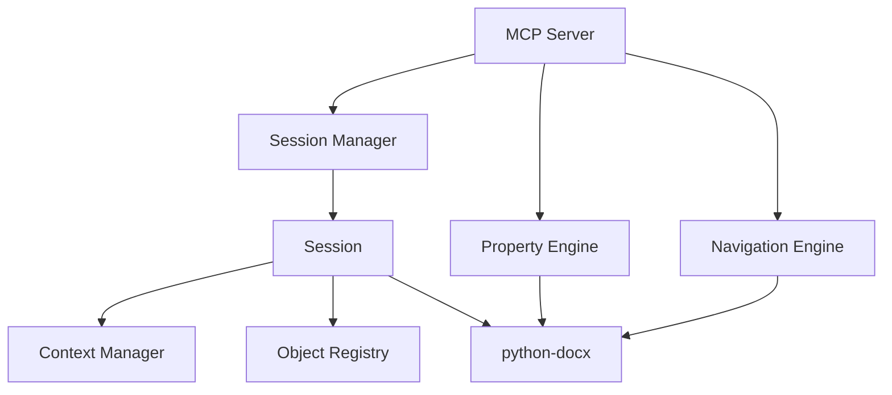

# 技术设计: Docx MCP Server 全功能重构

## 1. 架构设计

### 1.1 模块视图



### 1.2 核心组件

#### A. Session 增强 (Context Aware)
在 `Session` 类中增加上下文状态管理：
- `last_created_id`: 存储最近一次创建的对象 ID (Paragraph, Table, Run 等)
- `last_accessed_id`: 存储最近一次读取/修改的对象 ID
- `auto_save`: 布尔值，控制是否自动保存
- `file_path`: 关联的文件路径

#### B. Property Engine (属性引擎)
位于 `src/docx_mcp_server/core/properties.py`。
负责将字典格式的属性映射到 `python-docx` 的对象属性上。
支持递归属性设置，例如 `font.size` 或 `paragraph_format.alignment`。

#### C. Navigation Engine (导航引擎)
位于 `src/docx_mcp_server/core/finder.py`。
提供查找和定位功能：
- `get_by_index(type, index)`
- `find_by_text(text, type)`

## 2. 详细设计

### 2.1 混合上下文逻辑 (Hybrid Context)

**规则**:
1. **Creation**: `docx_insert_paragraph` -> 更新 `last_created_id` 和 `last_accessed_id`。
2. **Modification**: `docx_set_properties` (无 ID) -> 使用 `last_accessed_id`。
3. **Implicit Parent**: `docx_insert_run` (position=inside:para_xxx) -> 使用 `last_created_id` 检查是否为 Paragraph。

**代码变更**:
`src/docx_mcp_server/core/session.py`:
```python
class Session:
    def __init__(self, ...):
        self.last_created_id: Optional[str] = None
        self.last_accessed_id: Optional[str] = None
        self.auto_save: bool = False
        self.file_path: Optional[str] = None

    def update_context(self, element_id: str, action: str = "access"):
        self.last_accessed_id = element_id
        if action == "create":
            self.last_created_id = element_id
```

### 2.2 通用属性设置器

**接口**: `docx_set_properties(session_id, element_id=None, properties={})`

**映射逻辑**:
```python
MAP = {
    "bold": ("font.bold", bool),
    "color": ("font.color.rgb", RGBColor),
    "align": ("paragraph_format.alignment", WD_ALIGN_PARAGRAPH),
    # ...
}
```
需要处理枚举转换 (如 `WD_ALIGN_PARAGRAPH`) 和颜色转换 (Hex -> RGBColor)。

### 2.3 自动保存机制

在 `server.py` 的工具装饰器或逻辑中注入：
```python
if session.auto_save and session.file_path:
    session.document.save(session.file_path)
```

### 2.4 表格深拷贝技术方案 (XML Level)
由于 `python-docx` 原生不支持表格复制，我们将操作底层 XML：

```python
import copy
from docx.oxml import parse_xml

def clone_table(table):
    # Deep copy the XML element
    tbl_element = copy.deepcopy(table._tbl)
    # Create a new Table object wrapper
    new_table = Table(tbl_element, table._parent)
    # Append to the document body (or parent)
    table._parent._element.append(tbl_element)
    return new_table
```

### 2.5 跨 Run 文本替换方案
针对 Word 将 `{{key}}` 拆分为多个 Run 的问题（如 `Run1: "{{"`, `Run2: "key"`），采用 "Text Stitching" 策略：

1.  **扫描**: 遍历段落的所有 Run，拼接文本。
2.  **定位**: 在拼接后的文本中查找目标字符串位置。
3.  **重构**:
    - 如果替换范围跨越多个 Run，清除这些 Run。
    - 在第一个 Run 的位置插入新的 Run，包含替换后的文本。
    - 保留原第一个 Run 的格式。

### 2.6 批量填充方案
新增 `docx_fill_table(session_id, table_id, data=[[]], start_row=0)`：
- 接收二维数组 `data`。
- 从 `start_row` 开始，逐行填充。
- 智能处理：
    - 如果数据行数 > 表格行数，自动 `add_row()`。
    - 如果数据列数 > 表格列数，自动截断或忽略。
    - 保持单元格原有样式（使用 `cell.text = val` 而非替换 Run，除非需要格式控制）。

## 3. 接口变更 (MCP Tools)

### 3.1 新增工具
- `docx_get_context(session_id)`: 返回 `{last_created_id: "...", last_accessed_id: "...", "selected_text": "..."}`。
- `docx_fill_table(session_id, table_id, data, start_row=0)`: 批量填充表格。
- `docx_set_properties(...)`: (同上)
- `docx_insert_image(...)`: (同上)
- `docx_get_table(...)`, `docx_find_table(...)`, `docx_copy_table(...)`, `docx_replace_text(...)`: (同上)
- `docx_list_files(...)`: (同上)

### 3.2 修改工具
- `docx_set_properties`: 增加 JSON Schema 验证，支持 `json_schema` 验证属性结构。

## 4. 安全与约束
- **Schema 验证**: `docx_set_properties` 必须校验 JSON 结构，防止无效属性导致底层错误。
- **XML 操作风险**: 操作底层 XML 需异常捕获，防止破坏文档结构。

## 5. 数据结构

### 5.1 ID 注册表
保持现有的 UUID 映射机制，确保 ID 稳定性。

### 5.2 属性字典示例
```json
{
  "font": {
    "name": "Arial",
    "size": 12,
    "bold": true,
    "color": "FF0000"
  },
  "paragraph_format": {
    "alignment": "center",
    "space_after": 12
  }
}
```
