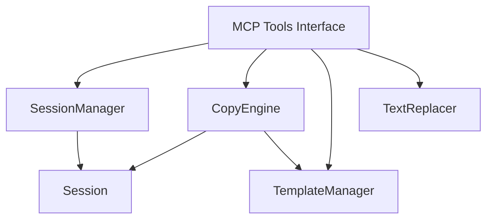

# 技术设计: 格式复制与模板系统

## 1. 架构概览

本系统旨在为 `docx-mcp-server` 提供深度的文档格式控制能力。核心架构由三部分组成：
1. **TemplateManager**: 负责格式属性的提取（序列化）和应用（反序列化）。
2. **CopyEngine**: 负责文档元素的克隆、递归复制和区间遍历。
3. **Session Extensions**: 扩展现有会话管理，支持元数据存储（用于来源追踪）。

### 1.1 模块依赖关系



## 2. 核心组件设计

### 2.1 Session 增强 (Metadata Support)

为了支持 R-007 (元素来源追踪)，我们需要在 `Session` 类中增加元数据存储能力。

**修改**: `src/docx_mcp_server/core/session.py`

```python
class Session:
    def __init__(self, session_id: str):
        self.session_id = session_id
        self.document = Document()
        self.object_registry = {}
        # 新增: 存储元素的元数据, key=element_id, value=dict
        self.element_metadata: Dict[str, Dict[str, Any]] = {}
        self.last_accessed = time.time()

    def register_object(self, obj, prefix: str, metadata: Dict[str, Any] = None) -> str:
        # 生成 ID
        element_id = f"{prefix}_{uuid.uuid4().hex[:8]}"
        self.object_registry[element_id] = obj

        # 存储元数据
        if metadata:
            self.element_metadata[element_id] = metadata

        return element_id

    def get_metadata(self, element_id: str) -> Dict[str, Any]:
        return self.element_metadata.get(element_id, {})
```

### 2.2 格式模板系统 (TemplateManager)

**文件**: `src/docx_mcp_server/utils/format_template.py`

负责将 `python-docx` 对象（Paragraph, Run, Table）的格式属性转换为 JSON 可序列化的字典，反之亦然。

**设计策略**:
- **复用现有逻辑**: 复用 `src/docx_mcp_server/core/format_painter.py` 中的 `FormatPainter` 类（`_copy_font_properties`, `_copy_paragraph_format` 等），避免重复代码。
- **数据结构**: 使用 `dataclass` 定义模板结构，确保类型安全。

```python
@dataclass
class FormatTemplate:
    type: str  # "paragraph", "run", "table"
    properties: Dict[str, Any]  # 扁平化的属性字典

    def to_json(self) -> str:
        return json.dumps(asdict(self))
```

**关键属性提取**:
- **Paragraph**: `alignment`, `style`, `paragraph_format` (indentation, spacing, keeps).
- **Run**: `font` (name, size, bold, italic, underline, color, highlight).
- **Table**: `style`, `alignment`, `autofit`.

### 2.3 复制引擎 (CopyEngine)

**文件**: `src/docx_mcp_server/utils/copy_engine.py`

负责处理复杂的复制逻辑，特别是递归复制（Run children）和 XML 元素顺序遍历。

**核心逻辑**:

1. **单元素复制 (Spike 验证)**:
   - 使用 `python-docx` 的 `_element` (lxml element) 进行 `deepcopy` 是最可靠的方法。
   - **风险点**: 如何将复制后的 XML 元素正确包装回 `Paragraph` 对象。需在 T-000 任务中进行技术验证。
   - **方案**: 可能需要通过 `document.element.body.insert` 插入 XML，然后重新读取或实例化包装类。

   ```python
   from copy import deepcopy

   def copy_element_xml(element):
       new_element = deepcopy(element._element)
       return new_element
   ```

2. **区间复制 (Range Copy)**:
   - **难点**: 确定两个 element_id 之间的所有元素。
   - **方案**: 遍历 `document.element.body` 的子节点。
   - **过滤逻辑**: 仅处理 `w:p` (paragraph) 和 `w:tbl` (table) 元素，忽略其他 XML 节点（如 `sectPr`）。
   - **算法**:
     1. 获取 start_id 和 end_id 对应的 element 对象。
     2. 遍历 `document.element.body` 的子节点。
     3. 找到 start 节点开始记录，直到 end 节点。
     4. 对列表中的每个有效 XML 元素进行深拷贝。
     5. 将拷贝的 XML 元素 append 到文档末尾。
     6. 将新元素包装为 python-docx 对象并注册到 Session。

### 2.4 批量文本替换 (TextReplacer)

**文件**: `src/docx_mcp_server/utils/text_tools.py`

提供高效的批量替换功能。

**算法与限制 (MVP)**:
- **策略**: 仅在 **Run 级别** 进行替换。
- **限制**: 如果关键词被拆分在不同 Runs（例如 "Hello" 的 "H" 是粗体，"ello" 是正常），则无法匹配。这是 python-docx 的常见限制。
- **原因**: 重新合并 Runs 再拆分极其复杂，容易破坏原有格式。MVP 阶段接受此限制。
- **实现**: 遍历 paragraph 的 runs，对 `run.text` 进行 `replace`。

## 3. 接口规范 (MCP Tools)

### 3.1 复制工具
- `docx_copy_paragraph(session_id, paragraph_id, format_only, track_source)`
- `docx_copy_heading(session_id, heading_id, ...)`
- `docx_copy_elements_range(session_id, start_id, end_id, ...)`

### 3.2 模板工具
- `docx_extract_format_template(session_id, element_id)`
- `docx_apply_format_template(session_id, element_id, template_json)`

### 3.3 辅助工具
- `docx_batch_replace_text(session_id, replacements, scope_id)`
- `docx_get_element_source(session_id, element_id)`

## 4. 数据存储

不需要持久化数据库。所有状态存储在内存中的 `Session` 对象里。
`Session` 生命周期由 `SessionManager` 控制。

## 5. 错误处理

- **无效 ID**: 抛出 `ValueError`。
- **类型不匹配**: 尝试应用段落模板到表格时，抛出明确错误或忽略不支持的属性。
- **区间无效**: 如果 start 和 end 不在同一文档层级，抛出错误。

## 6. 测试策略

- **Unit Test**: 测试 TemplateManager 的属性提取准确性。
- **Integration Test**: 复制一个包含多种格式的段落，验证新段落属性。
- **E2E Test**: 模拟用户操作：复制章节 -> 替换文本 -> 生成新文档。
