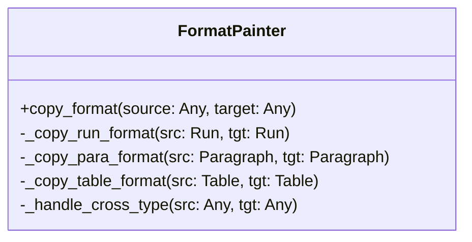

# 技术设计: Format Painter

> **功能**: format-painter
> **状态**: Draft
> **作者**: Claude
> **日期**: 2026-01-21

## 1. 架构设计

### 1.1 模块结构

核心逻辑将封装在 `src/docx_mcp_server/core/format_painter.py` 中，以保持 `server.py` 的整洁。

```python
src/docx_mcp_server/
├── core/
│   ├── format_painter.py  # 新增核心模块
│   └── ...
├── server.py              # API 入口
```

### 1.2 核心类图



## 2. 详细设计

### 2.1 格式复制策略

#### Run (文本)
复制 `font` 属性：
- `name`, `size`
- `bold`, `italic`, `underline`, `strike`
- `color.rgb` (ColorFormat)
- `highlight_color`
- `superscript`, `subscript`

#### Paragraph (段落)
复制 `paragraph_format` 和 `alignment`：
- `alignment`
- `left_indent`, `right_indent`, `first_line_indent`
- `space_before`, `space_after`
- `line_spacing`, `line_spacing_rule`
- `keep_together`, `keep_with_next`, `page_break_before`

#### Table (表格)
- **Style**: 直接复制 `table.style`
- **Grid**: 复制列宽配置
- **OXML (底层)**:
    - 复制 `tblPr` 中的 `tblBorders` (边框)
    - 复制 `tblPr` 中的 `shd` (底纹)
    - *注意*: 这是一个 "Best Effort" 操作，直接操作 XML 可能有兼容性风险，需做好异常捕获。

### 2.2 跨类型处理 (Smart Matching)

| Source | Target | 行为 |
|--------|--------|------|
| Para | Run | 提取 Para 的 style 中的字体属性应用到 Run |
| Run | Para | 提取 Run 的字体属性应用到 Para 的 `style.font` (或直接修改 Para 属性 if applicable) |
| Table | * | 抛出 ValueError |
| * | Table | 抛出 ValueError |

### 2.3 API 设计

```python
@mcp.tool()
def docx_format_copy(session_id: str, source_id: str, target_id: str) -> str:
    """
    Copy format from source element to target element.
    """
    # ... logic ...
```

## 3. 关键算法：Table OXML 复制

```python
def _copy_table_borders(src_table, tgt_table):
    src_tblPr = src_table._element.tblPr
    tgt_tblPr = tgt_table._element.tblPr

    # 查找 borders 节点
    src_borders = src_tblPr.find(qn('w:tblBorders'))
    if src_borders is not None:
        # 深拷贝节点
        new_borders = copy.deepcopy(src_borders)
        # 移除目标旧节点（如果有）
        old_borders = tgt_tblPr.find(qn('w:tblBorders'))
        if old_borders is not None:
            tgt_tblPr.remove(old_borders)
        # 添加新节点
        tgt_tblPr.append(new_borders)
```

## 4. 安全与错误处理

- **类型检查**: 严格检查 source 和 target 是否为有效的 python-docx 对象。
- **XML 兼容性**: 在操作 OXML 时使用 try-except 块，防止因版本差异导致的崩溃。
- **回滚**: 暂不支持事务性回滚，操作失败可能导致部分属性被应用（文档化此行为）。
