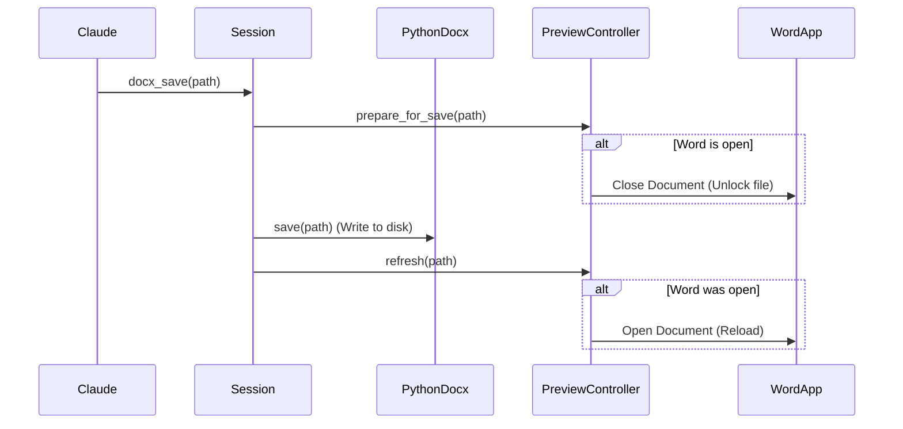

# 技术设计: Word/WPS 实时预览 (Live Preview)

> **功能**: live-preview
> **版本**: 1.0
> **日期**: 2026-01-21

## 1. 系统架构

本功能旨在为 Windows 用户提供文档修改后的实时反馈。由于 `python-docx` 是基于文件系统的操作（修改磁盘文件），而 Word/WPS 是基于内存的编辑器（且会锁定磁盘文件），核心挑战在于协调两者的文件访问权。

### 1.1 模块设计

新增 `docx_mcp_server.preview` 模块，包含以下组件：

1.  **`PreviewManager` (单例/工厂)**:
    *   负责根据操作系统环境返回合适的 `PreviewController` 实现。
    *   在 Linux/macOS 返回 `NoOpPreviewController`。
    *   在 Windows 返回 `Win32PreviewController`。

2.  **`PreviewController` (抽象基类)**:
    *   `attach(file_path: str) -> bool`: 尝试连接到已打开该文件的编辑器进程。
    *   `refresh(file_path: str) -> bool`: 触发编辑器刷新（关闭-保存-重开）。
    *   `detach()`: 清理 COM 引用。

3.  **`Win32PreviewController` (Windows 实现)**:
    *   使用 `pywin32` (`win32com.client`) 与 COM 交互。
    *   支持 `Word.Application` 和 `KWPS.Application` (WPS)。

### 1.2 交互流程



## 2. 关键技术实现

### 2.1 文件锁定处理 (The Locking Problem)

Word 打开文件时会建立排他性写入锁，导致 `python-docx` 的 `save()` 失败。

**解决方案**: "Close-Write-Reopen" 策略
1.  **Pre-save**: 检查 Word 是否打开了该文件。如果是，记录当前文档状态（如页码，但这很难精确恢复，暂且只恢复打开状态），然后调用 COM `Document.Close(SaveChanges=False)` 释放锁。
2.  **Save**: 执行 `python-docx` 的写入操作。
3.  **Post-save**: 调用 COM `Documents.Open(path)` 重新打开文件。

### 2.2 COM 连接 (Process Discovery)

使用 `GetObject` (ROT - Running Object Table) 查找现有的 Word 实例，而不是创建新实例。

```python
import win32com.client

def get_active_word():
    try:
        return win32com.client.GetActiveObject("Word.Application")
    except:
        return None
```

### 2.3 跨平台兼容

代码中使用 `sys.platform` 检查。
*   依赖管理：`pywin32` 应作为可选依赖或仅在 Windows 安装。考虑到 `uv` 的统一性，可以添加到 `project.optional-dependencies` 的 `gui` 或 `windows` 组，或者在代码中 `try-import`。

## 3. 数据结构

### 3.1 Session 扩展

在 `Session` 类中增加：

```python
class Session:
    def __init__(self, ...):
        # ... existing ...
        self.preview_controller = PreviewManager.get_controller()
        self.file_path = None  # 记录上次保存/加载的路径，用于自动关联
```

## 4. 接口变更

无新增 MCP 工具接口。仅修改现有 `docx_save` 的内部行为。

## 5. 风险与降级

*   **COM 异常**: COM 调用极易失败（如 Word 处于对话框模态）。策略：捕获所有 `pywintypes.com_error`，记录日志，降级为"仅保存，不预览"。
*   **性能**: 关闭重开 Word 文档需要时间（约 0.5s - 2s）。策略：这是用户获得实时预览的代价，可接受。
