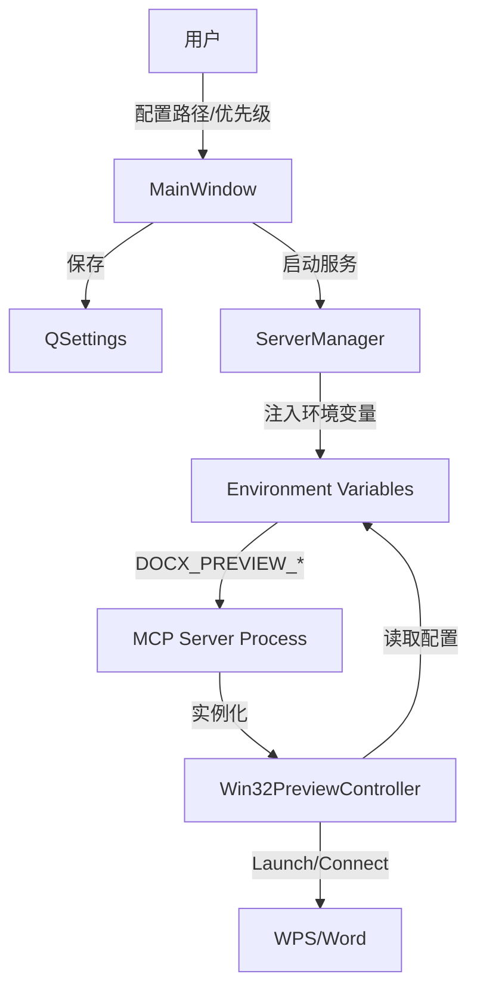

# 技术设计: 预览路径配置 (preview-path-config)

## 1. 架构概述

本功能旨在解决 `docx-server-launcher` 无法自动检测到非标准安装（如绿色版、便携版）的 Office 应用导致预览失败的问题。

### 核心变更

1.  **GUI 层 (`docx_server_launcher/gui`)**: 新增预览配置界面，允许用户指定 WPS/Word 可执行文件路径及优先级。
2.  **配置持久化 (`QSettings`)**: 保存用户配置的路径和优先级。
3.  **进程通信 (`ServerManager`)**: 将 GUI 配置通过环境变量传递给后台运行的 MCP Server。
4.  **预览核心 (`docx_mcp_server/preview`)**: 更新 `Win32PreviewController`，支持读取自定义路径并在 COM 连接失败时主动启动指定程序。

---

## 2. 模块设计

### 2.1 GUI 模块 (`MainWindow`)

在 `MainWindow` 中新增 "Preview Settings" (预览设置) GroupBox，位于 "Configuration" 和 "Control" 之间（或合并入 Configuration）。

**UI 组件**:
-   **WPS Path**: `QLineEdit` + `QPushButton` ("Browse")
-   **Word Path**: `QLineEdit` + `QPushButton` ("Browse")
-   **Priority**: `QComboBox` (Options: "Auto", "Prefer WPS", "Prefer Word")
    -   *注*: 现有的 `DOCX_PREVIEW_APP` 环境变量逻辑将被此 UI 替代。

**交互逻辑**:
-   点击 Browse 弹出文件选择器，过滤器 `Executables (*.exe)`。
-   选择后自动验证文件是否存在。
-   `start_server` 时读取这些控件的值。

### 2.2 数据持久化

复用 `QSettings("DocxMCP", "Launcher")`。

**新增 Key**:
-   `preview/wps_path`: string
-   `preview/word_path`: string
-   `preview/priority`: string ("auto", "wps", "word")

### 2.3 Server 启动与参数传递 (`ServerManager`)

`ServerManager.start_server` 方法签名无需大幅修改，但内部构建 `QProcess` 环境时需注入新的环境变量：

-   `DOCX_PREVIEW_WPS_PATH`: 用户配置的 WPS 路径
-   `DOCX_PREVIEW_WORD_PATH`: 用户配置的 Word 路径
-   `DOCX_PREVIEW_PRIORITY`: 用户配置的优先级

### 2.4 预览控制器 (`Win32PreviewController`)

修改 `src/docx_mcp_server/preview/win32.py`。

**初始化逻辑 (`__init__`)**:
1.  读取环境变量 `DOCX_PREVIEW_WPS_PATH` 和 `DOCX_PREVIEW_WORD_PATH`。
2.  读取 `DOCX_PREVIEW_PRIORITY` 决定 `app_prog_ids` 的顺序。

**激活逻辑 (`_get_active_app`) 增强**:
原逻辑仅尝试 `GetActiveObject`。新逻辑需支持"主动启动"：

```python
def _get_active_app(self):
    for app_type in priority_list:
        # 1. 尝试直接连接
        try:
             return GetActiveObject(prog_id)
        except:
             pass

        # 2. 如果配置了路径且连接失败，尝试主动启动
        if custom_path and os.path.exists(custom_path):
             subprocess.Popen(custom_path)
             sleep(2) # 等待启动
             try:
                 return GetActiveObject(prog_id)
             except:
                 pass
```

---

## 3. 数据流图



---

## 4. 接口定义

### 4.1 环境变量

| 变量名 | 描述 | 示例 |
|--------|------|------|
| `DOCX_PREVIEW_WPS_PATH` | WPS 可执行文件绝对路径 | `D:\Apps\WPS\wps.exe` |
| `DOCX_PREVIEW_WORD_PATH` | Word 可执行文件绝对路径 | `C:\Program Files\Microsoft Office\Office16\WINWORD.EXE` |
| `DOCX_PREVIEW_PRIORITY` | 优先级策略 | `wps`, `word`, `auto` (default) |

---

## 5. 安全考量

-   **路径验证**: 仅接受 `.exe` 结尾的文件，且必须实际存在。
-   **执行安全**: `subprocess.Popen` 仅执行用户显式配置的可信路径。

## 6. 兼容性

-   仅影响 Windows 平台 (`Win32PreviewController`)。
-   不影响非 GUI 启动方式（CLI 启动若不设置环境变量则维持原行为）。
