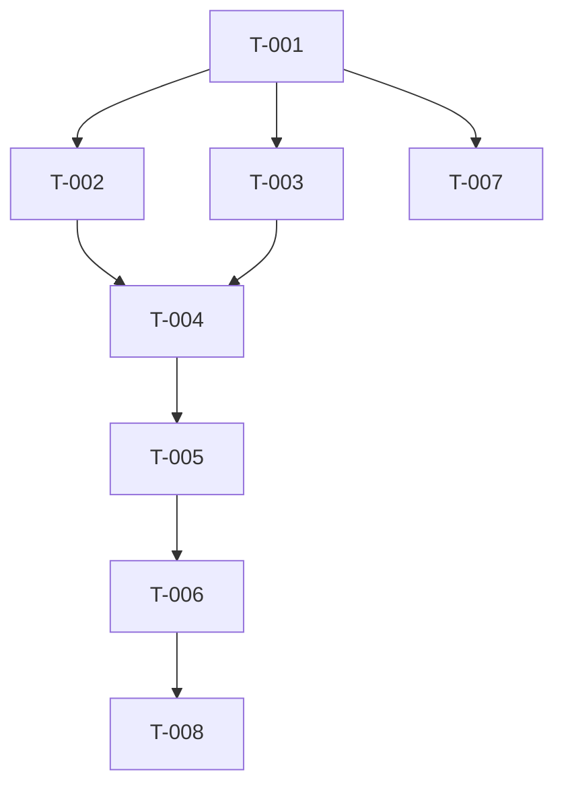

# 任务清单: 实时文档预览

> **功能标识**: realtime-preview
> **对应需求**: R-001 ~ R-005

## 任务列表

### Phase 1: 基础设施 (Infrastructure)

- [ ] **T-001**: 实现 PreviewController 抽象基类和工厂模式
  - `src/docx_mcp_server/preview/base.py`
  - `src/docx_mcp_server/preview/manager.py`
  - 定义 `refresh(path)` 接口
- [ ] **T-002**: 实现 macOS PreviewController
  - `src/docx_mcp_server/preview/macos.py`
  - 使用 `open` 命令
- [ ] **T-003**: 实现 Windows PreviewController
  - `src/docx_mcp_server/preview/windows.py`
  - 使用 `start` 命令，处理路径转义

### Phase 2: 核心集成 (Core Integration)

- [ ] **T-004**: 修改 Session 类支持预览状态
  - `src/docx_mcp_server/core/session.py`
  - 添加 `preview_enabled`, `preview_path` 属性
  - 实现 `_trigger_preview()` 方法，包含文件写入和异常处理（文件锁定）
- [ ] **T-005**: 集成变更触发机制
  - 在 `update_context` 或关键操作点调用 `_trigger_preview`
  - 确保不阻塞主线程（考虑异步或快速返回）

### Phase 3: 工具层暴露 (Tools Exposure)

- [ ] **T-006**: 更新 `docx_create` 工具
  - `src/docx_mcp_server/tools/session_tools.py`
  - 增加 `preview` 参数
  - 更新文档字符串

### Phase 4: 验证与测试 (Verification)

- [ ] **T-007**: 编写单元测试
  - Mock `subprocess` 调用验证控制器逻辑
  - 测试 Session 的预览触发逻辑
- [ ] **T-008**: 手动验证脚本 (E2E)
  - 编写 `scripts/demo_preview.py` 供手动测试窗口弹出

## 依赖关系

